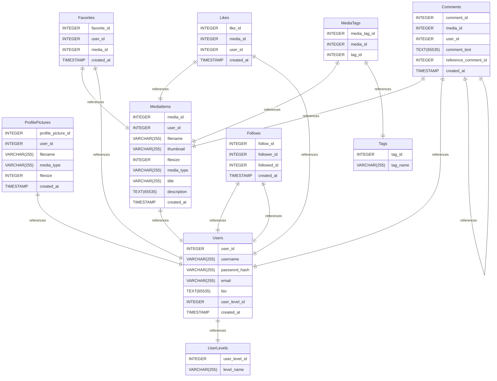

# Sovelluksen nimi: **MyLens**

---

## Kuvaus:
**MyLens** on sosiaalinen medianjakoalusta, jossa käyttäjät voivat julkaista kuvia ja videoita, tykätä ja kommentoida vapaasti julkaisuja sekä tallentaa mediaa suosikeiksi. Käyttäjät voivat vapaasti seurata muita käyttäjiä. Sovellus on ottanut inspiraatiota suosituimpien sosiaalisten medioiden ja viihdealustojen käyttöliittymistä.

---

## Toiminnot:

### 1. Käyttäjäprofiilit:
- Käyttäjät voivat luoda profiilin, johon he voivat lisätä tietoja itsestään
- Profiilin avulla saa auki mahdollisuuden tykätä, kommentoida, jakaa mediaa sekä seurata käyttäjiä.
- Käyttäjän omaava saa auki "following"-feedin jossa näkyy vain seurattujen käyttäjien media.
- Normaali käyttäjä voi poistaa julkaisunsa tai halutessaan koko tilinsä, joka poistaa myös tilin julkaiseman sisällön.
- Profiilikuvan lisääminen ja vaihtaminen. Vaihtaessa profiilikuvan, vanha kuva poistetaan myös taustapalvelun tiedostoista.
- Julkisesti esillä olevien tietojen muokkaaminen, kuten profiilin kuvauksen ja käyttäjänimen muokkaus.
- Ilman aktiivista käyttäjätiliä interaktiivisuus on hyvin rajallista.

### 2. Materiaalin jakaminen:
- Käyttäjät voivat ladata ja jakaa mediatiedostoja, eli kuvia ja videoita.
- Mahdollisuus lisätä kuvauksia ja tageja (esim. aihe), jotta materiaalin löytäminen olisi helpompaa.

### 3. Haku ja suodatus:
- Materiaalit voidaan etsiä hakusanojen, nimen, aiheen tai tagien avulla.
- Haku toimii dynaamisesti ilman haku-painikkeen painamista.
- Mahdollisuus hakea myös muita käyttäjiä nimeltä.

### 4. Keskustelu ja kommentointi:
- Käyttäjät voivat kommentoida ja keskustella jakamistaan medioista kommenttikentissä. Sovelluksessa on mahdollisuus vastata kommentteihin, jolloin kommentti liitetään alkuperäisen kommentin alle.

### 5. Ylläpitäjien oikeudet
- Ylläpitäjät voivat poistaa kommentteja (oikeus vain ylläpitäjillä), käyttäjien julkaisuja ja myös tilejä.

## Tekniset vaatimukset:

- **Frontend:** React ja TypeScript.
- **Backend:** Node.js ja Express (RESTful-arkkitehtuuri).
- **Tietokanta:** MySQL/MariaDB käyttäjätietojen, materiaalien ja keskusteluiden tallentamiseen.
- **Tiedostojen hallinta:** Tiedostojen lataus ja tallennus
- **Autentikointi:** Käyttäjien rekisteröinti ja kirjautuminen (JWT).
- **Responsiivinen käyttöliittymä:** Tailwind CSS
- **Progressiivinen web-sovellus:** Vite PWA toiminnallisuus.

---

## Tietokannan kuvaus:

# mylens documentation
## Summary

- [Introduction](#introduction)
- [Database Type](#database-type)
- [Table Structure](#table-structure)
	- [Users](#Users)
	- [UserLevels](#UserLevels)
	- [ProfilePictures](#ProfilePictures)
	- [MediaItems](#MediaItems)
	- [Tags](#Tags)
	- [MediaTags](#MediaTags)
	- [Comments](#Comments)
	- [Likes](#Likes)
	- [Follows](#Follows)
	- [Favorites](#Favorites)
- [Relationships](#relationships)
- [Database Diagram](#database-Diagram)

## Introduction

## Database type

- **Database system:** MySQL
## Table structure

### Users

| Name        | Type          | Settings                      | References                    | Note                           |
|-------------|---------------|-------------------------------|-------------------------------|--------------------------------|
| **user_id** | INTEGER | 🔑 PK, not null , unique, autoincrement |  | |
| **username** | VARCHAR(255) | not null , unique |  | |
| **password_hash** | VARCHAR(255) | not null  |  | |
| **email** | VARCHAR(255) | not null , unique |  | |
| **bio** | TEXT(65535) | not null  |  | |
| **user_level_id** | INTEGER | not null  | fk_Users_user_level_id_UserLevels | |
| **created_at** | TIMESTAMP | not null  |  | |

### UserLevels

| Name        | Type          | Settings                      | References                    | Note                           |
|-------------|---------------|-------------------------------|-------------------------------|--------------------------------|
| **user_level_id** | INTEGER | 🔑 PK, not null , unique, autoincrement |  | |
| **level_name** | VARCHAR(255) | not null  |  | |

### ProfilePictures

| Name        | Type          | Settings                      | References                    | Note                           |
|-------------|---------------|-------------------------------|-------------------------------|--------------------------------|
| **profile_picture_id** | INTEGER | 🔑 PK, not null , unique, autoincrement |  | |
| **user_id** | INTEGER | not null  | fk_ProfilePictures_user_id_Users | |
| **filename** | VARCHAR(255) | not null  |  | |
| **media_type** | VARCHAR(255) | not null  |  | |
| **filesize** | INTEGER | not null  |  | |
| **created_at** | TIMESTAMP | not null  |  | |

### MediaItems

| Name        | Type          | Settings                      | References                    | Note                           |
|-------------|---------------|-------------------------------|-------------------------------|--------------------------------|
| **media_id** | INTEGER | 🔑 PK, not null , unique, autoincrement |  | |
| **user_id** | INTEGER | not null  | fk_MediaItems_user_id_Users | |
| **filename** | VARCHAR(255) | not null  |  | |
| **thumbnail** | VARCHAR(255) | not null  |  | |
| **filesize** | INTEGER | not null  |  | |
| **media_type** | VARCHAR(255) | not null  |  | |
| **title** | VARCHAR(255) | not null  |  | |
| **description** | TEXT(65535) | not null  |  | |
| **created_at** | TIMESTAMP | not null  |  | |

### Tags

| Name        | Type          | Settings                      | References                    | Note                           |
|-------------|---------------|-------------------------------|-------------------------------|--------------------------------|
| **tag_id** | INTEGER | 🔑 PK, not null , unique, autoincrement |  | |
| **tag_name** | VARCHAR(255) | not null  |  | |

### MediaTags

| Name        | Type          | Settings                      | References                    | Note                           |
|-------------|---------------|-------------------------------|-------------------------------|--------------------------------|
| **media_tag_id** | INTEGER | 🔑 PK, not null , unique, autoincrement |  | |
| **media_id** | INTEGER | not null  | fk_MediaTags_media_id_MediaItems | |
| **tag_id** | INTEGER | not null  | fk_MediaTags_tag_id_Tags | |

### Comments

| Name        | Type          | Settings                      | References                    | Note                           |
|-------------|---------------|-------------------------------|-------------------------------|--------------------------------|
| **comment_id** | INTEGER | 🔑 PK, not null , unique, autoincrement |  | |
| **media_id** | INTEGER | not null  | fk_Comments_media_id_MediaItems | |
| **user_id** | INTEGER | not null  | fk_Comments_user_id_Users | |
| **comment_text** | TEXT(65535) | not null  |  | |
| **reference_comment_id** | INTEGER | not null  | fk_Comments_reference_comment_id_Comments | |
| **created_at** | TIMESTAMP | not null  |  | |

### Likes

| Name        | Type          | Settings                      | References                    | Note                           |
|-------------|---------------|-------------------------------|-------------------------------|--------------------------------|
| **like_id** | INTEGER | 🔑 PK, not null , unique, autoincrement |  | |
| **media_id** | INTEGER | not null  | fk_Likes_media_id_MediaItems | |
| **user_id** | INTEGER | not null  | fk_Likes_user_id_Users | |
| **created_at** | TIMESTAMP | not null  |  | |

### Follows

| Name        | Type          | Settings                      | References                    | Note                           |
|-------------|---------------|-------------------------------|-------------------------------|--------------------------------|
| **follow_id** | INTEGER | 🔑 PK, not null , unique, autoincrement |  | |
| **follower_id** | INTEGER | not null  | fk_Follows_follower_id_Users | |
| **followed_id** | INTEGER | not null  | fk_Follows_followed_id_Users | |
| **created_at** | TIMESTAMP | not null  |  | |

### Favorites

| Name        | Type          | Settings                      | References                    | Note                           |
|-------------|---------------|-------------------------------|-------------------------------|--------------------------------|
| **favorite_id** | INTEGER | 🔑 PK, not null , unique, autoincrement |  | |
| **user_id** | INTEGER | not null  | fk_Favorites_user_id_Users | |
| **media_id** | INTEGER | not null  | fk_Favorites_media_id_MediaItems | |
| **created_at** | TIMESTAMP | not null  |  | |

## Relationships

- **ProfilePictures to Users**: one_to_one
- **Users to UserLevels**: one_to_one
- **Favorites to MediaItems**: one_to_one
- **Favorites to Users**: one_to_one
- **Likes to MediaItems**: one_to_one
- **Likes to Users**: one_to_one
- **MediaTags to MediaItems**: one_to_one
- **MediaTags to Tags**: one_to_one
- **Comments to MediaItems**: one_to_one
- **Comments to Users**: one_to_one
- **Comments to Comments**: one_to_one
- **Follows to Users**: one_to_one
- **Follows to Users**: one_to_one
- **MediaItems to Users**: one_to_one

## Database Diagram

